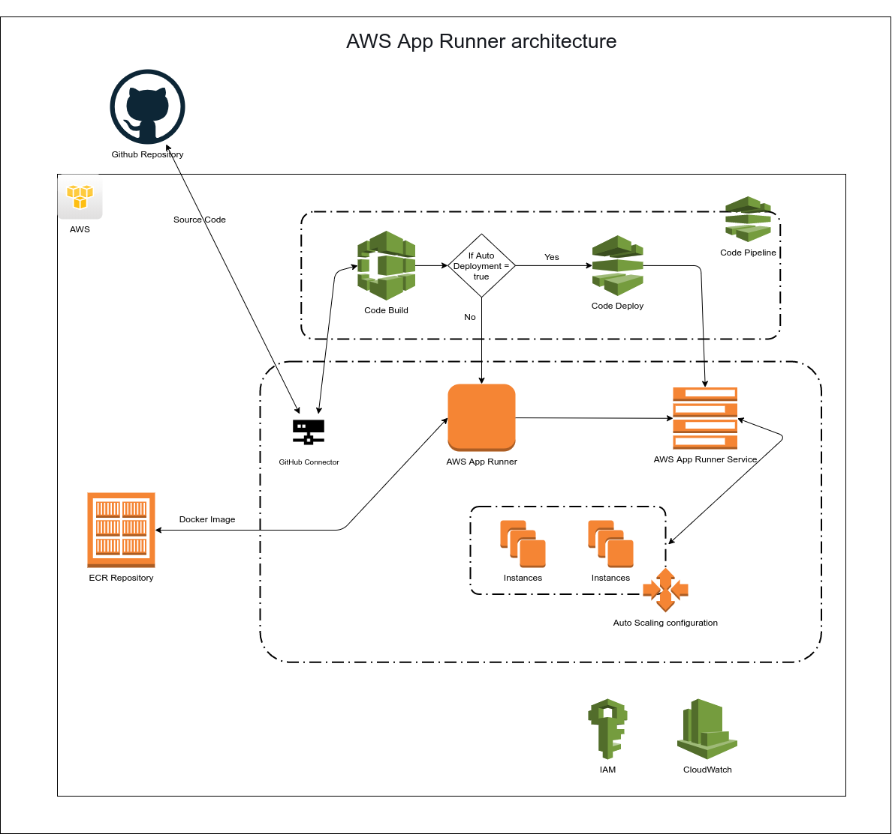

# AWS App Runner Terraform
AWS App Runner is a fully managed service that makes it easy for developers to quickly deploy containerized web applications and APIs, at scale and with no prior infrastructure experience required. Start with your source code or a container image. App Runner automatically builds and deploys the web application and load balances traffic with encryption. App Runner also scales up or down automatically to meet your traffic needs. With App Runner, rather than thinking about servers or scaling, you have more time to focus on your applications.

This repository contains the terraform configuration based script to deploy your application on AWS App Runner.

### AWS Resources covered in this setup
- IAM role/policy
- App Runner service
- Auto Scaling
- App Runner Connection (To Connect Github)



## Setup Terraform 
- If you don't have Terraform set up on your machine(Local or ec2) please follow this link to configure
[Download Terraform](https://www.terraform.io/downloads.html) ,
[Configure Terraform](https://learn.hashicorp.com/tutorials/terraform/install-cli)

## Script Feature
 We have 3 ways to deploy your application on App Runner
- Deploy Application with Github repository
- Deploy Application with ECR Private repository
- Deploy Application with ECR public repository

### We have to change `terraform.tfvar` according to deployment type.
#### Deploy Application with Github repository

```
isECR                = false
build_command        = "Application build command(If required)"
runtime              = "Application runtime environment like PYTHON_3 | NODEJS_12"
start_command        = "Application start command(If required)"
configuration_source = "REPOSITORY | API"
repository_url       = "Github repository url"
repository_branch    = "branch name"
port                 = "Port"

```
Note: For now you have to configure github connection manually because terraform not allow to approve created github connection automatically.
https://registry.terraform.io/providers/hashicorp/aws/latest/docs/resources/apprunner_connection
When you create github connection you have to allow aws to access you github repository so for that you have to allow that permission manually.
#### Deploy Application with ECR Private repository

```
isECR                 = true
image_repository_type = "ECR"
image_identifier      = "ECR repository image uri
port                  = "Port"
```

#### Deploy Application with ECR public repository 

```
isECR                 = true
image_repository_type = "ECR_PUBLIC"
image_identifier      = "Public image uri"
port                  = "Port"
```

## Setup Terraform user profile
- Open `provider.tf`
- Add the AWS-CLI profile name the same as we add a profile for s3 backend configuration.
```
provider "aws" {
  region  = "${var.region}"
  profile = "<AWS-CLI PROFILE NAME>" //If you run this script using AWS EC2 of CodePipeline remove this line
}
```
-  Add terraform.tfvars file
```
cp terraform.sample.tfvars terraform.tfvars
```
- It will create `terraform.tfvars` file.

- [terraform.tfvars](./terraform.tfvars) has all the required environment variables required for the terraform setup. 
- Once all changes done we are ready to deploy our terraform.
- Run `terraform plan` to verify all created resources.
- Run `terraform apply` to create all resources on the AWS account given region.
- If you want to delete infrastructure run `terraform destroy`.
